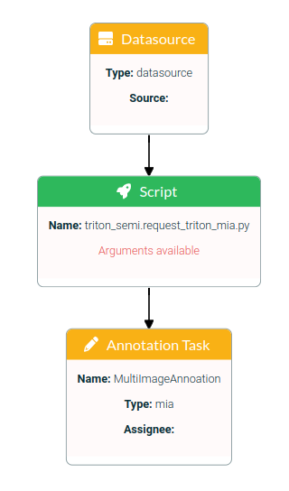
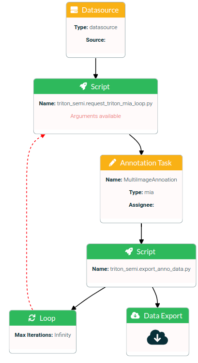
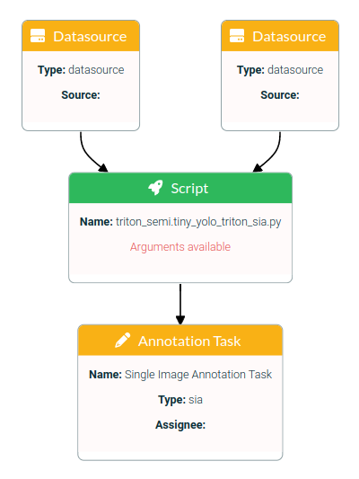
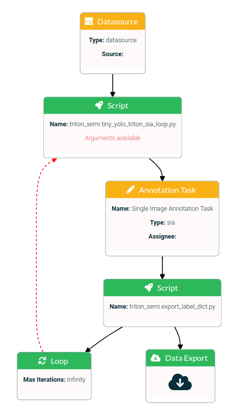

# lost_semi_auto_pipes
This repo is currently under construction!

## About
Adaptions of pylessons repo for tiny yolo pre- and postprocessing (https://github.com/pythonlessons/TensorFlow-2.x-YOLOv3) 
and Triton Inference Server (https://github.com/triton-inference-server)

## Description
Pipelines for semi automatic annotation.
To get faster annotation data these pipelines use pretrained models for classification or object detection  proposals.
It is possible to train a model in a loop or if there is a pretrained model for your data you can generate new annotations.
The object detection pipelines work with a [tiny yolo v4](https://github.com/l3p-cv/lost_ootb_pipes) Tensorflow model.
The classifaction pipelines work with a [Kreas MobileNet](https://keras.io/api/applications/mobilenet/) Tensorflow model.

## Installation
1. Install LOST
    * follow the [quicksetup](https://github.com/l3p-cv/lost)
2. Import Pipelines
    * import the pipelines to your LOST- Application, follow [README](https://github.com/l3p-cv/lost-pipeline-zoo/blob/master/README.md) in LOST Pipeline Zoo
    * In README at step 6. add the url of this [repository](git@github.com:l3p-cv/lost_semi_auto_pipes.git)

3. Install model server and -repository
    * [install](https://github.com/triton-inference-server/server.git) Triton Inference Server
    * create a [model repository](https://github.com/triton-inference-server/server/blob/main/docs/getting_started/quickstart.md)
    * structure the [model repository](https://github.com/triton-inference-server/server/blob/main/docs/user_guide/model_repository.md)
    Example of a Tensorflow model repository structure:
    ```
    model_repository
    ├── model_name_1
    │   ├── 1
    │   │   └── model.savedmodel
    │   │       ├── assets
    │   │       ├── variables
    │   │       │   ├── variables.data-00000-of-00001
    │   │       │   └── variables.index
    │   │       ├── keras_metadata.pb
    │   │       └── saved_model.pb
    │   ├── 2
    │   │   └── model.savedmodel
    │   │       ├── assets
    │   │       ├── variables
    │   │       │   ├── variables.data-00000-of-00001
    │   │       │   └── variables.index
    │   │       ├── keras_metadata.pb
    │   │       └── saved_model.pb
    │   ├── config.pbtxt
    └── model_name_2
        └── 1
            └── model.savedmodel
                ├── assets
                ├── variables
                │   ├── variables.data-00000-of-00001
                │   └── variables.index
                ├── keras_metadata.pb
                └── saved_model.pb

    ```
    * The directory named by numbers presents the model version. In default settings the pipeline will use the newest version.
    * It is possible to config specific model settings by your own in the config.pbtxt (check [Triton model config](https://github.com/triton-inference-server/server/blob/main/docs/user_guide/model_configuration.md))

## Options in Annotaion task
1. Info
    * Enter name and instructions for annotators.
2. Annotators
    * Choose annotators from a list for the task.
3. Label tree
    * Choose the label tree from a list for the task
4. Labels
    * Choose complete label tree or sub tree by clicking the knot
5. Configuration
    * configure the available options for the task

# Pipelines
## request_triton_mia
### Description
Request multi image annotations with a Tensorflow model classification proposals for all images of a specified data source.

### How do I use the pipeline ?
1. load Tensorflow model to the model repository
    * to use this pipeline it is not nessery to add or edit the config.pbtxt 
2. Setup and configure the pipeline
    * start the pipeline request_triton_mia

        

    * datasource block: 
        * choose your image data directory
    * script block: 
        * click on "arguments available" and configure them
        * model_name: Enter the name of your model. It is the name of the directory in your model repository, see structure example above.
        * url: Enter the url of the Triton Inference Server
        * port: Enter the port of the Triton Inference Server (at the moment only 8000 for http request is possible)
    * annotation task block: 
        * [Edit](#options-in-annotaion-task) options
    * Info
        * Enter a pipeline name and description
    * Complete
        * click on start pipe
3. Annotate
    * go to annotation menu
    * annotate the task
    * if the annotation task is finshed, export the data
4. Data export
    * go to pipelines
    * open the pipeline
    * annotation task block:
        * choose a export name
        * choose export type LOST_Dataset
        * click generate export
        * download the annotation data


## request_triton_mia_loop
### Description
Request multi image annotations with model classification proposals for all images of a specified data source.
This Pipeline runs in a loop. At the first iteration the images will be annotated manual. Use this annotation data to [train](add link to repo) the model for next iteration. The number of loops is pending on the number of images in the datasource and the image batch size per loop.

### How do I use the pipeline ?
1. Setup and configure the pipeline
    * start the pipeline request_triton_mia_loop

        

    * datasource block: 
        * choose your image data directory
    * script block (request_triton_mia_loop): 
        * click on "arguments available" and configure them
        * valid_imgtypes: These are the supported image types
        * model_name: Enter the name of your model. It is the name of the directory in your model repository, see structure example above.
        * url: Enter the url of the Triton Inference Server
        * port: Enter the port of the Triton Inference Server (at the moment only port 8000 for http request is possible)
        * img_batch: Enter the image batch size per iteration
    * annotation task block: 
        * [Edit](#options-in-annotaion-task) options
    * Info
        * Enter a pipeline name and description
    * Complete
        * click on start pipe
2. Annotate
    * go to annotation menu
    * annotate the task
    * if the annotation task is finshed, export the data
3. Data export
    * go to pipelines
    * open the pipeline
    * Data export block:
        * download anno_data.parquet
4. Loop
    * loop to script block (request_triton_mia_loop)
    * [train](add link to repo) model with annotation data
    * load model to model repository. The model has to be newer since the loop befor
    * script check the model repository for a new model
    * the script is pending until there is a higher version directory in repository
    * model propose bounding boxes for next image batch
    * annote and enhance the proposals (step 3)
    * Data export (step 4)

## tiny_yolo_triton_sia
### Description
Request single image annotations with model object detection proposals for all images of a specified data source.
Supported is **tiny yolo v4 Tensorflow** model.
The model is trainable in a loop with the tiny_yolo_triton_sia_loop pipeline.

### How do I use the pipeline ?
1. load Tensorflow model to the model repository
    * to use this pipeline it is not nessery to add or edit the config.pbtxt    
2. Setup and configure the pipeline
    * start the pipeline tiny_yolo_triton_sia

        

    * datasource block: choose your image data directory
        * choose your image data directory in one datasource
        * choose your anno data directory in the other datasource. In this directory has to be an anno data file as json.
    * script block: 
        * click on "arguments available" and configure them
        * valid_imgtypes: These are the supported image types
        * model_name: Enter the name of your model. It is the name of the directory in your model repository, see structure example above.
        * url: Enter the url of the Triton Inference Server
        * port: Enter the port of the Triton Inference Server (at the moment only port 8000 for http request is possible)
    * annotation task block: 
        * [Edit](#options-in-annotaion-task) options
    * Info
        * Enter a pipeline name and description
    * Complete
        * click on start pipe
3. Annotate
    * go to annotation menu
    * annotate the task
    * if the annotation task is finshed, export the data
4. Data export
    * go to pipelines
    * open the pipeline
    * annotation task block:
        * choose a export name
        * choose export type LOST_Dataset
        * click generate export
        * download the annotation data

## tiny_yolo_triton_sia_loop
### Description
Request single image annotations with model object detection proposals for all images of a specified data source.
This Pipeline runs in a loop. At the first iteration the images will be annotated manual. Use this annotation data to [train](https://github.com/l3p-cv/lost_yolov3_tf2) the model for next iteration. The number of loops is pending on the number of images in the datasource and the image batch size per loop.

Supported is **tiny yolo v4 Tensorflow** model.

### How do I use the pipeline ?
1. Setup and configure the pipeline
    * start the pipeline tiny_yolo_triton_sia_loop

        

    * datasource block: 
        * choose your image data directory
    * script block (tiny_yolo_triton_sia_loop): 
        * click on "arguments available" and configure them
        * valid_imgtypes: These are the supported image types
        * model_name: Enter the name of your model. It is the name of the directory in your model repository, see structure example above.
        * url: Enter the url of the Triton Inference Server
        * port: Enter the port of the Triton Inference Server (at the moment only port 8000 for http request is possible)
        * img_batch: Enter the image batch size per iteration
    * annotation task block: 
        * [Edit](#options-in-annotaion-task) options
    * Info
        * Enter a pipeline name and description
    * Complete
        * click on start pipe
2. Annotate
    * go to annotation menu
    * annotate the task
3. Data export
    * go to pipelines
    * open the pipeline
    * Data export block:
        * download anno_data.parquet
        * download anno_data.json
4. Loop
    * loop to script block (tiny_yolo_triton_sia_loop)
    * [train](https://github.com/l3p-cv/lost_yolov3_tf2) model with annotation data
    * load model to model repository. The model has to be newer since the loop befor
    * script check the model repository for a new model
    * the script is pending until there is a higher version directory in repository
    * model propose bounding boxes for next image batch
    * annote and enhance the proposals (step 3)
    * Data export (step 4)
